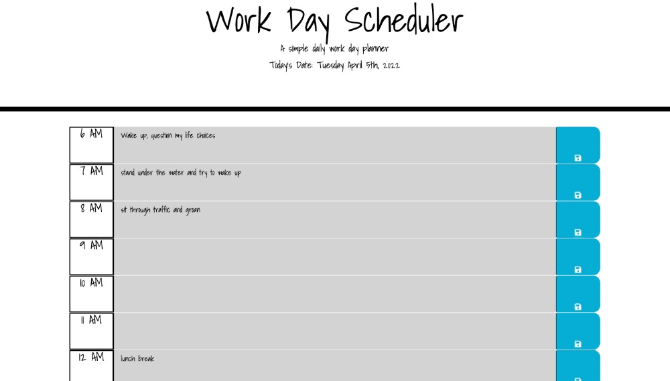

# Assingment 5: Work Day Scheduler

For this assignment, we were tasked with making a simple work day planner using Third Party APIs.

### Deployed link:

[Erica's Work Day Scheduler](https://ericabreig.github.io/hw-5-scheduler/)

## Description

The planner allows the user to type in their plans for each hour of their work day.
(I added extra hours to account for commuting and typical overtime hours.)
When they hit the save button, it saves their input to the local file, even after refreshing the page.
In this assignment, I learned to utilize the following:

- jQuery for simplified functions
- Bootstrap for styling and formatting
- Google fonts for styling
- saving user input to local storage

### Below is an example of how the app should function:

## Credit

Myself, and Trilogy Education Services for providing the starter code.
